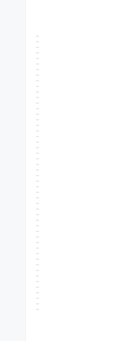

# dsh-message-rail

[](https://www.npmjs.com/package/dsh-message-rail)
[](https://www.npmjs.com/package/dsh-message-rail)
[](LICENSE)

Codex 风格左侧消息导航轨道 —— 在 DeepSeek Harness Web UI 的长会话里快速定位历史提问。

> Left-side message navigation rail for the DeepSeek Harness Web UI: jump to any past user message in long sessions, Codex-style.

> 交互灵感来自 Codex 的消息导航栏（inspired by Codex's message rail）。本插件与 OpenAI 无关联。

## 效果预览

会话左侧的消息导航轨道（悬停刻度显示预览卡，点击跳转到对应消息）：


轨道贴会话区左缘，与界面主题自适应：



## 功能

- **等距刻度轨道**：会话左侧一条 42px 轨道，每条用户消息一个刻度（固定 11px 间距）；轨道默认高度 550px（约 50 条），屏幕不足时撑满
- **悬停预览**：相邻刻度逐级变长（23/17/12/9px 波纹），右侧浮出预览卡（序号 + 相对时间 + 消息文本）
- **点击跳转**：平滑滚动到对应消息并主题色描边高亮；历史未加载时自动加载更早页
- **全量索引**：后台自动加载整个会话历史（无需手动翻页），轨道显示全部用户消息
- **虚拟滚动**：任意会话规模下只渲染可见窗口 ±12 条缓冲，DOM 恒定、滚动流畅
- **渲染门控**：攒够可见上限（50 条）或全部历史加载完才首次渲染，不会出现半成品轨道
- **当前位置**：视口 40% 线最近的消息刻度深色高亮，滚动即知读到哪
- **智能滚动**：轨道钉在最新刻度，手动滚动后停止跟随；隐藏滚动条、滚轮可用
- **细节**：少于 2 条用户消息自动隐藏；明暗主题自适应；`prefers-reduced-motion` 降级；键盘可悬停（focus 等价 hover）

## 兼容性

- DeepSeek Harness `0.1.0-rc.6` 或更高
- Node.js 22+
- 浏览器：Chrome / Edge / Safari / Firefox 最新版

## 安装

插件通过 DeepSeek Harness 的 `dsh` 命令安装。下面每个命令都给出两种等价写法：

- **dsh 形式**：适用于已全局安装 dsh（`npm install -g @deepseek-ai/dsh`）
- **npx 形式**：无需安装 dsh，临时调用，效果相同——**推荐**（dsh 尚在快速迭代，全局安装非必需）

### 从 npm 安装（推荐，免构建授权）

```bash
# dsh 形式
dsh plugin --profile web add dsh-message-rail

# npx 形式（无需安装 dsh）
npx @deepseek-ai/dsh plugin --profile web add dsh-message-rail
```

### 从 GitHub 安装

```bash
# dsh 形式
dsh plugin --profile web add github:wx-yss/dsh-message-rail

# npx 形式
npx @deepseek-ai/dsh plugin --profile web add github:wx-yss/dsh-message-rail
```

### 本地开发安装

```bash
git clone git@github.com:wx-yss/dsh-message-rail.git
cd dsh-message-rail
pnpm install
npx @deepseek-ai/dsh plugin --profile web add .
```

### 重启

安装后**完整重启** dsh web：

```bash
# dsh 形式
dsh web

# npx 形式
npx @deepseek-ai/dsh web
```

## 使用

打开包含至少两条用户消息的会话，左侧即出现导航轨道：

- **悬停**刻度 → 波纹展开 + 预览卡（序号 / 时间 / 文本）
- **点击**刻度 → 跳转到对应消息
- **滚轮**在轨道上滚动 → 浏览更早/更晚的刻度
- 滚动会话 → 当前位置刻度高亮

## 已知限制

- 全量加载采用 DSH 的 `loadOlder` 分页（每页 50 条消息，接口无参数可调）；页数上限 400（约 2 万条消息），超长会话超出部分不索引
- 千条级超长会话完整索引约需数秒，期间轨道刻度持续增长
- 轨道仅索引用户消息（`kind === 'user'`），不包含助手回复、工具调用、steering/注入上下文
- 轨道配色跟随 DSH 运行时主题（`--dsw-*` 设计令牌），不支持独立于 DSH 的配色偏好
- 轨道刻度为虚拟窗口渲染，键盘 Tab 可达（focus 等价悬停）；DOM 锚点（`data-chat-anchor-key` / `data-conversation-scroll`）为 DSH 内部契约，随 DSH 版本可能变化

## 文件结构

```
├── package.json         # dsh.client（Web 插件）+ dsh.bundle（profile patch）声明
├── cordis.patch.yml     # bundle patch：插入插件行
├── lib/
│   ├── index.js         # Host 半部：空 apply 占位
│   └── client.js        # Client 半部：轨道 UI + 全量加载 + 虚拟滚动 + 跳转
├── assets/              # README 效果截图
├── LICENSE              # MIT
└── README.md
```

## 实现要点

- 挂载：`shell.overlay` 声明会话级子 seat `message-rail.rail`（`SessionProvider` 桥接，每会话一个实例）
- 数据：`useSession` 快照 `chat.order` + `chat.nodes`，过滤 `node.kind === 'user'`；分页经 `hasMore` / `loadingOlder` / `session.loadOlder()`
- 跳转：`[data-conversation-scroll]` + `[data-chat-anchor-key]` DOM 锚点 → `scrollIntoView` + 描边闪烁
- 虚拟窗口：`floor(scrollTop / 11) - 12` 到 `ceil((scrollTop + 高度) / 11) + 12`，绝对定位刻度

## License

MIT
